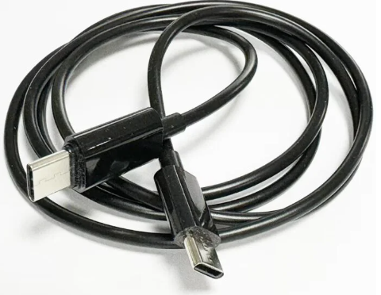
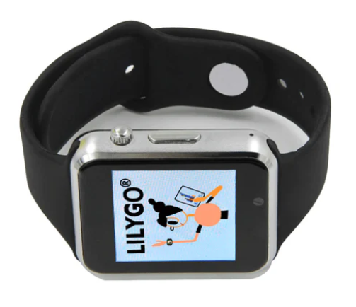
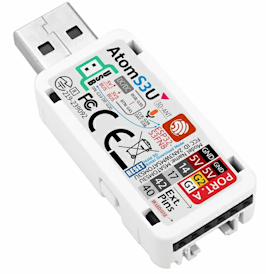
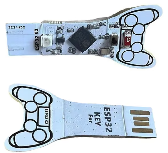
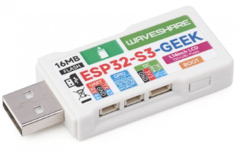
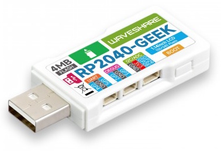

# USB Army Knife

  Introducing the USB Army Knife – the ultimate tool for penetration testers and red teamers.
    

Compact and versatile, this device packs a punch with its extensive capabilities, including USB HID attacks, mass storage emulation, network device impersonation and WiFi/Bluetooth exploits (thanks to our forked version of ESP32 Marauder).

Complete control over how and when your payloads are run. Plug in and execute, leave behind and trigger over WiFi, run on a timer or build a Hollywood-esq UI. Manage and deploy your attacks effortlessly using just a phone using a user-friendly Bootstrap web interface.

Want more? Deploy the agent and execute commands even when the machine is locked. Working over the serial interface egress is incredibly hard to detect. You can even view the victims screen over the devices' dedicated WiFi connection.

Equip yourself with the USB Army Knife and elevate your local access toolkit to the next level.

## Testimonials

*"Your device is evil. You are doing evil."* - Mr. Peoples via X

## Intro
There is a problem with physical access/USB attacks today. On their own, each attack doesn't provide enough of a solution to meet most objectives.
* USB keyboard attacks (Ducky, HID&Run) require a logged on machine and even the best tools don’t provide a solution to this.
* Networking attacks (poison tap and alike) might get you a password hash but often require something complex hanging out of an Ethernet port to get this back for offline cracking.
* When you get on a box, what options do you still have for exfiltrating data when anything that opens a socket is getting sent to VT.

What was needed is a physical access platform that enables a suitable rogue to take the best bits of each attack and workaround their respective problems with another attack. Ideally this platform would be so cheap and covert that losing one wouldn't be an issue.

This is why I decided to create the USB Army Knife. 
* Want to become a USB Ethernet adapter PCAP the interface and egress it over WiFI? USB Army Knife.
* Want to wrap your attacks in custom UI or just show a Hollywood interface when your attack has worked? USB Army Knife
* Want a covert storage device? USB Army Knife
* Want to deauth everyone on the WiFi, PCAP the renegotiation and email this to yourself when the machine has been left unlocked for offline cracking? USB Army Knife
* Want your attack to destroy itself when it’s been found? USB Army Knife
* What to connect to other bits of hardware, motion sensors and alike? USB Army Knife.
* Want to view what’s on the victim's screen over WiFi? USB Army Knife.
* Want to record what your victim is saying? USB Army Knife.

## Video
[This video shows how the ultimate rick roll works](./examples/rickroll/)

https://github.com/user-attachments/assets/f373e18e-5cad-4871-9f2a-17523fa33398

[This video shows how the USB PCAP functionality and has a brief peak at the web interface](./examples/usb_ethernet_pcap/)

https://github.com/user-attachments/assets/0d5b1485-b808-46c6-aaf7-7cf016088b8f

[This video shows how to pull the victims machine once the agent has been installed](./examples/vnc/) 

https://github.com/user-attachments/assets/3c866d29-ef26-4eaf-943b-1206b8c40101

## Features
This project implements a variety of attacks based around an easily concealable USB/WiFi/BT dongle. The attacks include sending BadUSB (USB HID commands using DuckyScript), appearing as mass storage devices, appearing as USB network devices, and performing WiFi and Bluetooth attacks with ESP32 Marauder. Attacks are deployed using a Ducky-like language you probably already know and love. This language has been agumented with a raft of custom commands and even the entire ESP32 Marauder capability (improved). Attacks include:

- **USB HID Attacks**: Send custom HID commands using DuckyScript, supports BadUSB & USB HID and run style attacks. Supports multiple keyboard layouts/languages.
- **Mass Storage Device**: Emulate a USB mass storage device (USB drive and CDROM).
- **USB Network Device**: Appear as a USB network device.
- **WiFi and Bluetooth Attacks**: Utilize ESP32 Marauder for WiFi and Bluetooth attacks. Include EvilAP, Deauth and pcap.
- **Hot Mic**: Plug in a USB device and stream audio over WiFi

## Examples

| Name      | Description   |
| ------------- | ------------- |
| [Covert Storage](./examples/covertstorage/) | Example showing how to masquerade as two different USB mass storage devices. The first time the device is plugged in the devices appears with the full contents of the micro SD card. In all subsequence attempts a different 'benign' drive appears. |
| [Progress Bar](./examples/progressbar/) | Images are displayed on the devices LCD screen showing a progress bar. Great for those Hollywood style attacks or if you want a visual indicator to show an attack has deployed. |
| [Ultimate RickRoll](./examples/rickroll/) | Inject keystrokes to display the famous rickroll video but also uses ESP32 Marauder to blast the lyrics over WiFi. |
| [USB Ethernet PCAP](./examples/usb_ethernet_pcap/) | Turns the device into a USB network adapter and collects a PCAP of the first few seconds of network traffic. |
| [Deploy the serial agent](./examples/install_agent_and_run_command/) | Deploys the agent if it isn't already installed and sends commands over the serial port. Command output can be seen in the web interface|
| [Pull the screen](./examples/vnc/) | Deploys the agent, the agent includes a tiny VNC server. Now the screen can be viewed via the web interface|
| [Simple UI](./examples/simple_ui/) | A simple yet powerful UI to select scripts/images and run these using the hardware button. Shows how you can build complex UI interactions simply.  |
| [Stream Mic audio over WiFi](./examples/hotmic/) | The M5Stack AtomS3U has a microphone that you can stream over WiFi.  |
| [Instantly crash Linux boxes](./examples/linux_panic/) | Deploy a bad filesystem which cause Linux machines which automount to panic. |
| [Evil USB CDROM/NIC](./examples/malicious_ethernet_adapter/) | Pretend to be a USB NICs which requires a driver from a CDROM device that appears when you plug the NIC in. |
| [Use different keyboard layouts](./examples/multiple_keyboard_layouts/) | Automatically support different keyboard layouts without rewriting your payloads |

## Supported Hardware

| Hardware     | Supported      | Purchase Links |
| ------------ | -------------- | -------------- |
| **LilyGo T-Dongle S3**  (Recommended) | The LilyGo T-Dongle S3 is a USB pen drive shaped ESP32-S3 development board. It features a colour LCD screen, physical button, hidden/covert micro SD card adapter (inside the USB-A connector) as well as a SPI adapter. It has 16MB of flash. It is based on the ESP32-S3 chipset which enables it to host a WiFi station as well as support a range of WiFi and Bluetooth attacks. *It is incredibly cheap!* There are two versions of this device with and without the screen. Only the version with the screen has been tested.  | <ul><li>[AliExpress](https://s.click.aliexpress.com/e/_DCMq0ZX)</li><li>[Amazon UK](https://amzn.to/3YuNCg3)</li><li>[Amazon US](https://amzn.to/4f4AqUk)</li><li>[eBay UK](https://ebay.us/3TJVed)</li></ul>
| **Evil Crow Cable Wind**  | The Evil Crow Cable Wind is a malicious implanted USB cable with a ESP32-S3 hidden inside, it comes in a couple of different variations. One end can be used for active USB attacks whilst the other is intended to charge a device. Its unique design makes it one of the most covert USB Army Knife capable devices. For this reason the device doesn't have a screen, SD card or LEDs or a good hardware button (there is one inside that requires the use of a magnet). Instead of an SD card, flash memory is used to store files. **NOTE** Whilst it's possible to run a wireless access point on these devices the unit can get very hot. To counter this USB Army Knife supports thermal throttling and will turn the WiFi off if the device is overheating. To completely avoid this issue you should connected to an existing wireless network (that than host an access point) or disable WiFI, the device then does not overheat. | <ul><li>[USB-A to USB-C AliExpress](https://s.click.aliexpress.com/e/_EGxBPoe)</li>   <li>[USB-C to USB-C AliExpress](https://s.click.aliexpress.com/e/_Ez0U334)</li> </ul>
| **T-Watch S3**  | The T-Watch S3 is a smart watch platform with a a ton of hardware packed inside including screen, WiFi, real time clock, mic, accelerometer, infrared, haptic feedback and a LoRa transceiver. Much of this is already supported by the USB Army Knife platform. The watch crown acts as a button and there is a mini USB port for charging / HID attacks. As the watch is based on the ESP32-S3 chipset it can host a WiFi station as well as support a range of WiFi and Bluetooth attacks. Crucially it does not have an SD card slot and flash memory is used to store files. As such attack scripts and any results are limited to ~10MB. The flashing of this platform is a little more complex, check the Wiki for guidance on how to get your device up and running.| <ul><li>[AliExpress](https://s.click.aliexpress.com/e/_ExPs5dU)</li></ul>
| **Waveshare ESP32-S3 1.47inch**  | This device is similar in design, size and features to the LilyGo T-Dongle S3 and uses the same chipset. It is clearly a dev board as it doesn't come with a case and has exposed circuitry on the underside. Where this device betters the T-Dongle S3 is that it has a very large high quality screen and 8MB of additional RAM. | <ul><li>[AliExpress](https://s.click.aliexpress.com/e/_DmlJI3x)</li><li>[eBay UK](https://ebay.us/E4gFr5])</li></ul>
| **M5Stack AtomS3U**  | This is an ESP32-S3 development board with two external interface at the rear. It doesn't feature a screen or an SD card, but does have an LED and a button. Instead of an SD card the flash memory is used to store files. Unusually it also contains a digital microphone and IR LED that are not currently supported. To put the device in boot mode hold RESET (the button on the side of the device) until a green LED comes on. | <ul><li>[AliExpress](https://s.click.aliexpress.com/e/_EIAUNXX)</li></ul>
| **ESP32 Udisk**  | The most basic device that can run the USB Army Knife code is a ESP32-S2 chip connected to a USB port. Often you can find these sold in a very similar enclosures to the T-Dongle S3 and tend to advertised on sites like AliExpress as Playstation 4 jailbreaks under the name 'USB Dongle Udisk for P4'. These devices lack RAM, a screen, SD card, Bluetooth, LEDs and a good hardware button. Instead of an SD card, flash memory is used to store tiny files. These devices are incredibly cheap and are often good at running HID+WiFi payloads (like the rick roll). **Warning** They are too underpowered to run the webserver. When buying these **beware** that they can often be confused with a very similar looking device that includes a CH343P chipset and no reset button. **Make sure the device you buy has a button that can be pushed with a paperclip.** Ensure you flash this device with the Generic-ESP32-S2 configuration.  | <ul><li>[AliExpress](https://s.click.aliexpress.com/e/_Dn5wXe5)</li><li>[Amazon UK](https://amzn.to/3Y4hrCE)</li><li>[Amazon US](https://amzn.to/4h98Jf4)</li><li>[eBay UK](https://ebay.us/AVZcK0)</li></ul>
| **ESP32 Key**  | Very similar to the ESP32 UDisk (please see that description for a list of things it can't do) this is an ESP32-S2 on a circuit board. It is probably the cheapest device that can just about run USB Army Knife and has a price point to match. You'll need to hold down the button when you plug it in to get the device into flashing mode. Ensure you flash this device with the Generic-ESP32-S2 configuration. | <ul><li>[AliExpress](https://s.click.aliexpress.com/e/_EyliW13)</li></ul>
| **Waveshare-ESP32-GEEK**  | ESP32-GEEK is a development board designed by Waveshare. It has USB-A, 1.14-inch LCD screen, an SD card and has external ports (SWD, UART and I2C), it doesn't have an LED. Hold down the button when you plug it in to get the device into flashing mode. This device has some SD card issues (compatibility and low speed). You may need to use 8GB partitions and try a few card brands to find something compatible (I found a Kingston 64gb card with a 9GB partition worked YMMV). | <ul><li>[AliExpress](https://s.click.aliexpress.com/e/_EJsjVAc)</li><li>[Amazon UK](https://amzn.to/41hLVnn)</li><li>[Amazon US](https://amzn.to/3QnV9rW)</li></ul>
| **Waveshare-RP2040-GEEK**  | RP2040-GEEK is a development board designed by Waveshare. It has USB-A, 1.14-inch LCD screen, an SD card and has external ports (SWD, UART and I2C). **This board does not run the ESP32 chipset. USB ethernet (NCM) mode are whole disk SD usage are both currently unsupported. ESP32 Maurader cannot work on this device!** On Windows you may also need to set this device to use a WinUSB driver using [Zadig](https://zadig.akeo.ie/). Hold down the button when you plug it in to get the device into flashing mode. | <ul><li>[AliExpress](https://s.click.aliexpress.com/e/_EvdfVGH)</li><li>[Amazon UK](https://amzn.to/3YZvD1f)</li><li>[Amazon US](https://amzn.to/3YY4Ouy)</li></ul>

## Getting Started
Please check the [wiki](https://github.com/i-am-shodan/USBArmyKnife/wiki) for a step by step guide.

### Installation

There are two options for getting the USB Army Knife firmware onto your device:
* [Flashing pre-built firmware using your web browser (easiest route)]([https://github.com/i-am-shodan/USBArmyKnife/wiki/Installation#using-a-web-browser](https://github.com/i-am-shodan/USBArmyKnife/wiki/Installation#flashing-with-a-web-browser))
* [Building and flashing the source using Visual Studio Code (more powerful)]([https://github.com/i-am-shodan/USBArmyKnife/wiki/Installation#using-visual-studio-code](https://github.com/i-am-shodan/USBArmyKnife/wiki/Installation#flashing-with-visual-studio-code-and-platformio))

### Usage

1. Connect the USB dongle to your computer.
1. Connect to the WiFi access point (iPhone14) with the password of 'password'
1. Access the web interface (http://4.3.2.1:8080) by navigating to the URL with your browser.
1. Ensure the web interface has correctly loaded. You should see thr currently running status and uptime. If not refresh the page.
1. Use the web interface to create and manage your attacks using DuckyScript.

*ESP-S2 based devices have WiFi support but do not have a web interface. Attacks are managed via DuckyScript files.*
*RP2040 devices do not have ESP32 Maurader capability*

## How to get help
* Questions about DuckyScript?
  * [DuckyScript quick reference](https://docs.hak5.org/hak5-usb-rubber-ducky/duckyscript-tm-quick-reference)
  * [The USB Army Knife command reference](https://github.com/i-am-shodan/USBArmyKnife/wiki) 
* Problem getting started?
  * Check out the examples
  * [The discussions pages](https://github.com/i-am-shodan/USBArmyKnife/discussions)
* Found a bug?
  * [Create an issue](https://github.com/i-am-shodan/USBArmyKnife/issues)

## Future plans

### USB Host Mode / Mobile device support
There is no reason the USB Army Knife can't also operate in USB host mode. That is the same mode a computer works in. In this way the USB Army Knife can issue commands as if it was a computer. With most smart phones supporting PTP (picture transfer protocol) this means you could in theory plug in a USB Army Knife (with a USB adapter) into a phone and have it pull the photos off.

[Espressif have documentation for USB host mode](https://docs.espressif.com/projects/esp-idf/en/latest/esp32s3/api-reference/peripherals/usb_host.html) and also [example code](https://github.com/espressif/esp-idf/tree/master/examples/peripherals/usb/host). They do not have an example for the PTP protocol.
You can collect a PCAP of your phone using PTP using [USB PCAP](https://desowin.org/usbpcap/) there is even a WireShark [dissector](https://wiki.wireshark.org/USB-PTP)

## Contributing

Contributions are welcome! Please fork the repository and submit a pull request.

## Contact

If you have any questions or suggestions, feel free to reach out to us:

- Raise an issue on the repository: [GitHub Repository](https://github.com/i-am-shodan/usb-army-knife)
- Connect with us on Twitter: [@therealshodan](https://twitter.com/therealshodan)

## License

This project is licensed under the MIT License - see the LICENSE file for details.

## Acknowledgments

- Inspired by various BadUSB projects and the ESP32 Marauder project.

## Star History

