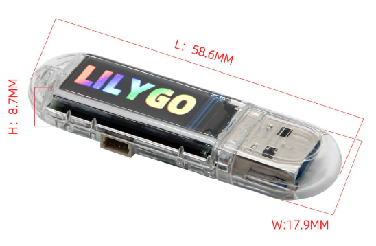
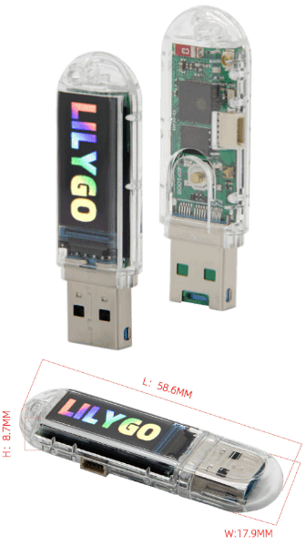
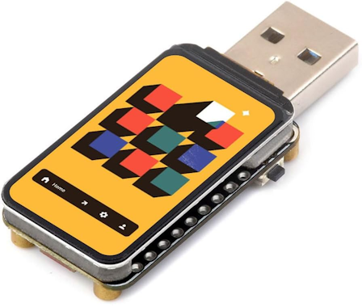
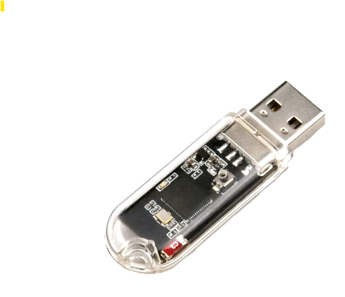

<a href="https://github.com/i-am-shodan/USBArmyKnife/blob/master/LICENSE"></a>
[](https://github.com/i-am-shodan/USBArmyKnife/actions/workflows/main.yml)
[](https://github.com/i-am-shodan/USBArmyKnife/actions/workflows/dotnet.yml)
<a href="https://twitter.com/intent/follow?screen_name=therealshodan"></a>
[](https://ko-fi.com/O5O8145AVW)

# USB Army Knife

<div align="center">
  Introducing the USB Army Knife – the ultimate tool for penetration testers and red teamers.
     
</div>

Compact and versatile, this device packs a punch with its extensive capabilities, including USB HID attacks, mass storage emulation, network device impersonation and WiFi/Bluetooth exploits (using ESP32 Marauder).

Complete control over how and when your payloads are run. Plug in and execute, leave behind and trigger over WiFi, run on a timer or build a Hollywood-esq UI. Manage and deploy your attacks effortlessly using just a phone using a user-friendly Bootstrap web interface.

Want more? Deploy the agent and execute commands even when the machine is locked. Working over the serial interface egress is incredibly hard to detect. You can even view the victims screen over the devices' dedicated WiFi connection.

Equip yourself with the USB Army Knife and elevate your local access toolkit to the next level.

## Intro
There is a problem with physical access/USB attacks today. On their own, each attack doesn't provide enough of a solution to meet most objectives.
* USB keyboard attacks (Ducky, HID&Run) require a logged on machine and even the best tools don’t provide a solution to this.
* Networking attacks (poison tap and alike) might get you a password hash but often require something complex hanging out of an Ethernet port to get this back for offline cracking.
* When you get on a box, what options do you still have for exfiltrating data when anything that opens a socket is getting sent to VT.

What was needed is a physical access platform that enables a suitable rogue to take the best bits of each attack and workaround their respective problems with another attack. Ideally this platform would be so cheap and covert that losing one wouldn't be an issue.

This is why I decided to create the USB Army Knife. 
* Want to become a USB Ethernet adapter PCAP the interface and egress it over WiFI? USB Army Knife.
* Want to wrap your attacks in custom UI or just show a Hollywood interface when your attack has worked? USB Army Knife
* Want a covert storage device? USB Army Knife
* Want to deauth everyone on the WiFi, PCAP the renegotiation and email this to yourself when the machine has been left unlocked for offline cracking? USB Army Knife
* Want your attack to destroy itself when it’s been found? USB Army Knife
* What to connect to other bits of hardware, motion sensors and alike? USB Army Knife.
* Want to view what’s on the victim's screen over WiFi? USB Army Knife.

## Video
[This video shows how the ultimate rick roll works](./examples/rickroll/)

https://github.com/user-attachments/assets/f373e18e-5cad-4871-9f2a-17523fa33398

[This video shows how the USB PCAP functionality and has a brief peak at the web interface](./examples/usb_ethernet_pcap/)

https://github.com/user-attachments/assets/0d5b1485-b808-46c6-aaf7-7cf016088b8f

[This video shows how to pull the victims machine once the agent has been installed](./examples/vnc/) 

https://github.com/user-attachments/assets/3c866d29-ef26-4eaf-943b-1206b8c40101

## Features
This project implements a variety of attacks based around an easily concealable USB/WiFi/BT dongle. The attacks include sending BadUSB (USB HID commands using DuckyScript), appearing as mass storage devices, appearing as USB network devices, and performing WiFi and Bluetooth attacks with ESP32 Marauder. Attacks are deployed using a Ducky-like language you probably already know and love. This language has been agumented with a raft of custom commands and even the entire ESP32 Marauder capability. Attacks include:

- **USB HID Attacks**: Send custom HID commands using DuckyScript, supports BadUSB & USB HID and run style attacks.
- **Mass Storage Device**: Emulate a USB mass storage device.
- **USB Network Device**: Appear as a USB network device.
- **WiFi and Bluetooth Attacks**: Utilize ESP32 Marauder for WiFi and Bluetooth attacks.

## Examples

| Name      | Description   |
| ------------- | ------------- |
| [Covert Storage](./examples/covertstorage/) | Example showing how to masquerade as two different USB mass storage devices. The first time the device is plugged in the devices appears with the full contents of the micro SD card. In all subsequence attempts a different 'benign' drive appears. |
| [Progress Bar](./examples/progressbar/) | Images are displayed on the devices LCD screen showing a progress bar. Great for those Hollywood style attacks or if you want a visual indicator to show an attack has deployed. |
| [Ultimate RickRoll](./examples/rickroll/) | Inject keystrokes to display the famous rickroll video but also uses ESP32 Marauder to blast the lyrics over WiFi. |
| [USB Ethernet PCAP](./examples/usb_ethernet_pcap/) | Turns the device into a USB network adapter and collects a PCAP of the first few seconds of network traffic. |
| [Deploy the serial agent](./examples/install_agent_and_run_command/) | Deploys the agent if it isn't already installed and sends commands over the serial port. Command output can be seen in the web interface|
| [Pull the screen](./examples/vnc/) | Deploys the agent, the agent includes a tiny VNC server. Now the screen can be viewed via the web interface|
| [Simple UI](./examples/simple_ui/) | A simple yet powerful UI to select scripts/images and run these using the hardware button. Shows how you can build complex UI interactions simply.  |

## Supported Hardware

| Hardware     | Supported      |
| ------------- | ------------- |
| **LilyGo T-Dongle S3**  (Recommended) | The LilyGo T-Dongle S3 is a USB pen drive shaped ESP32-S3 development board. It features a colour LCD screen, physical button, hidden/covert micro SD card adapter (inside the USB-A connector) as well as a SPI adapter. It has 16MB of flash. It is based on the ESP32-S3 chipset which enables it to host a WiFi station as well as support a range of WiFi and Bluetooth attacks. *It is incredibly cheap!* There are two versions of this device with and without the screen. Only the version with the screen has been tested.  |
| **Waveshare ESP32-S3 1.47inch**  | This device is similar in design, size and features to the LilyGo T-Dongle S3 and uses the same chipset. It is clearly a dev board as it doesn't come with a case and has exposed circuitry on the underside. Where this device betters the T-Dongle S3 is that it has a very large high quality screen and 8MB of additional RAM. |
| **Pure ESP32-S2**  | The most basic device that can run the USB Army Knife code is a ESP32-S2 chip connected to a USB port. Often you can find these sold in a very similar enclosures to the T-Dongle S3 and tend to advertised on sites like AliExpress as Playstation 4 jailbreaks under the name 'USB Dongle Udisk for P4'. These devices lack RAM, a screen, SD card, Bluetooth, LEDs and a good hardware button. Instead of an SD card, flash memory is used to store tiny files. These devices are incredibly cheap and are often good at running HID+WiFi payloads (like the rick roll). **Warning** They are too underpowered to run the webserver. When buying these **beware** that they can often be confused with a very similar looking device that includes a CH343P chipset and no reset button. **Make sure the device you buy has a button that can be pushed with a paperclip.** |

## Purchase links

### LilyGo T-Dongle S3
* [Amazon UK](https://amzn.to/3YuNCg3)
* [Amazon US](https://amzn.to/4f4AqUk)

### Waveshare ESP32-S3 1.47inch
* TODO

### Generic ESP32-S2
* [Amazon UK](https://amzn.to/3Y4hrCE)
* [Amazon US](https://amzn.to/4h98Jf4)

## Getting Started

### Prerequisites

- **Hardware**:
   * A supported device, ideally the LilyGo T-Dongle S3 with screen.
   * For device with an SD card you'll need a FAT32 formatted micro SD card.
      * For large cards this should have *at most* a single 32GB partition.
- **Software**: 
  * [Visual Studio Code](https://code.visualstudio.com/Download)
  * [PlatformIO Visual Studio Code extension](https://platformio.org/platformio-ide)
  * GIT

### Preparing your SD card

The USB Army Knife may not run correctly with large SD cards or those with newer filesystems. We recommend using one with at most one 32GB FAT32 partition for maximum compatibility. Smaller capacities can also be used.
[This article on partitioning an SD card](https://www.instructables.com/Repartition-SD-Card-Windows/) can help with the process of doing this on Windows.

**Note** On first run, if an SD card cannot be found with a supported filesystem the device will offer to format it for you. If you use this option the filesystem created on the SD card may not work under Windows. As such it is advised to create a suitable SD card off device.

### Installation

1. Clone the repository:
    ```sh
    git clone https://github.com/i-am-shodan/USBArmyKnife.git
    ```
1. Now you've cloned the repo you need to pull down the submodules. Run this command in the directory you just cloned to. If you don't do this you will get errors related to ESP32Maurauder
    ```sh
    git submodule update --init 
    ```
1. Open the project in Visual Studio Code

1. *Optional: add any additional keyboard layouts you need by editing the platform.ini file* 

1. Click the PlatformIO icon (Alien icon)

1. (Remove the dongle if it was inserted) **Press and hold the hardware button**, insert the device, wait 1s and **release the button**.
   * You should now seen a new COM port/serial device attached to your machine 

1. In the menu expand the device you want to flash.
   * For the T-Dongle S3 you should expand 'LILYGO-T-Dongle-S3'
   * For a generic ESP32-S2 you should expand 'Generic-ESP32-S2'
   * It may take a few seconds to populate the build menu after you've selected your device

1. Press 'Upload'

1. *Only if your device does NOT have an SD card.*
   1. *Edit the files for the flash filesystem, these are stored in the 'data' directory.*
   1. *Expand the Platform folder in the build menu from the previous step.*
   1. *Click 'Upload Filesystem Image'.*

1. When the upload has finished successfully, remove the dongle and insert the micro SD card if you have one

### Updating the codebase to the latest version

If you want to update an existing install you need to:
1. Use `git pull` to grab the latest changes to this repository
1. Run `git submodule update --recursive` to make sure all the submodules are up to date
1. Click 'Full Clean' in the PlatformIO build menu.
At this point all your code and dependencies will be up to date and you can continue with the build steps above.

### Usage

1. Connect the USB dongle to your computer.
1. Connect to the WiFi access point (iPhone14) with the password of 'password'
1. Access the web interface (http://4.3.2.1:8080) by navigating to the URL with your browser.
1. Ensure the web interface has correctly loaded. You should see thr currently running status and uptime. If not refresh the page.
1. Use the web interface to create and manage your attacks using DuckyScript.

*ESP-S2 based devices have WiFi support but do not have a web interface. Attacks are managed via DuckyScript files.*

### Future plans

#### USB Host Mode / Mobile device support
There is no reason the USB Army Knife can't also operate in USB host mode. That is the same mode a computer works in. In this way the USB Army Knife can issue commands as if it was a computer. With most smart phones supporting PTP (picture transfer protocol) this means you could in theory plug in a USB Army Knife (with a USB adapter) into a phone and have it pull the photos off.

[Espressif have documentation for USB host mode](https://docs.espressif.com/projects/esp-idf/en/latest/esp32s3/api-reference/peripherals/usb_host.html) and also [example code](https://github.com/espressif/esp-idf/tree/master/examples/peripherals/usb/host). They do not have an example for the PTP protocol.
You can collect a PCAP of your phone using PTP using [USB PCAP](https://desowin.org/usbpcap/) there is even a WireShark [dissector](https://wiki.wireshark.org/USB-PTP)

## Contributing

Contributions are welcome! Please fork the repository and submit a pull request.

## Contact

If you have any questions or suggestions, feel free to reach out to us:

- Raise an issue on the repository: [GitHub Repository](https://github.com/i-am-shodan/usb-army-knife)
- Connect with us on Twitter: [@therealshodan](https://twitter.com/therealshodan)

## License

This project is licensed under the MIT License - see the LICENSE file for details.

## Acknowledgments

- Inspired by various BadUSB projects and the ESP32 Marauder project.

## Star History

[](https://star-history.com/#i-am-shodan/USBArmyKnife&Date)
